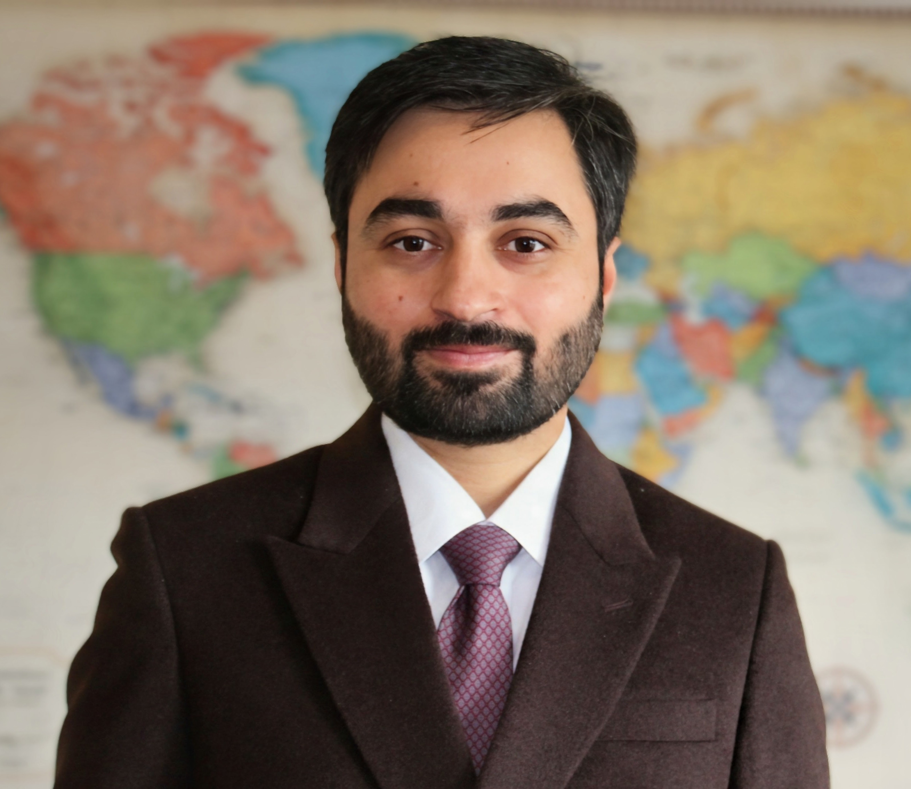

  

  

    

      <strong>Email:</strong> sbanjara [at] uchicago [dot] edu
    

    

      <a href="./PDF/banjara_cv.pdf" target="_blank" rel="noopener noreferrer">CV</a>
      &nbsp;&nbsp;&nbsp;
      <a href="https://scholar.google.com/citations?user=oSvWJAgAAAAJ&hl=en&inst=5778974199078678248"
         target="_blank" rel="noopener noreferrer">Google Scholar</a>
    

  

  Welcome! I am a PhD candidate at the University of Chicago, Harris School of Public Policy. I use applied microeconomics to study topics in environmental economics, political economy, and the intersection of the two.
  
  In environmental economics, my research focuses on understanding the value of biodiversity and the efficacy of conservation policies; in political economy, I study the state's role in violence against its citizens; and at the intersection of the two fields, I study the political interactions between the winners and losers of land-use decisions and natural resource extraction.
  
  I have a bachelor's degree in civil engineering from the Institute of Engineering, Pulchowk Campus, and a master's degree in environmental science with a focus on remote sensing from the Yale School of the Environment. My research typically involves constructing and analysing large spatial datasets. 

<!--- Email at the bottom --->

  <strong>Email:</strong> sbanjara (at) uchicago (dot) edu

